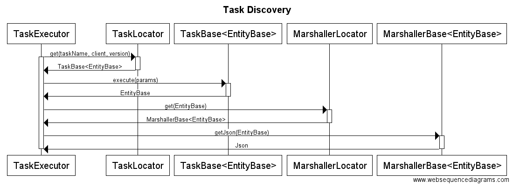

# cart-backend POC

## Platforms
* [dropwizzard](dropwizzard/cart-backend/)
* [spark](spark/cart-backend/)
* [nodejs](node/cart-backend/)

## Proposed Task Discovery (alpha)



**TODO: upload app/task config hierarchy diagram**

## POC Scope (help guidelines)

The main goal is to review the platforms at boudary (http) level

* Task resolution can be mocked
* Support client and version discovery (identifies client, NOT api)
 * RequestHeader: X-API-CLIENT: client name
 * RequestHeader: X-API-VERSION: client version
* Must support CORS
* Must return 404 when the task returns null
* Must catch validation errors and return 422 (with error structure)
* Cross endpoint support (potentially supported by all endpoints)
 * Paging (?page=2&pageSize=5)
 * Field filtering (?fields=[field1,[fieldN]])
* Implement sample endpoints

```
GET		/carts/{id}								Get cart
DELETE	/carts/{id}								Removes cart
POST	/carts/{id}/items						Add cartItem to cart
DELETE	/carts/{id}/items?status=<status>		Clear "normal" items
DELETE	/carts/{id}/items?status=<status>		Clear "savedForLater" items
PUT		/carts/{id}/items/{id}					Update cartItem on cart (or change list)
DELETE	/carts/{id}/items/{id}					Removes cartItem from cart
```

## Call samples

GET existing cart
```bash
http://localhost:3000/carts/666
```

GET non-existing cart
```bash
http://localhost:3000/carts/404
```

GET validation error
```bash
http://localhost:3000/carts/422
```

GET internal error
```bash
http://localhost:3000/carts/500
```

CORS pre-flyght
```bash
curl -H "Origin: http://some.com" -H "Access-Control-Request-Method: POST" -H "Access-Control-Request-Headers: X-Requested-With" -X OPTIONS -v http://localhost:3000
```

DELETE cart item (identifying client)
```bash
curl -X DELETE -H "X-API-CLIENT:sono_io" -H "X-API-VERSION:23.56.782" http://localhost:3000/carts/666/items/111 -v
```
